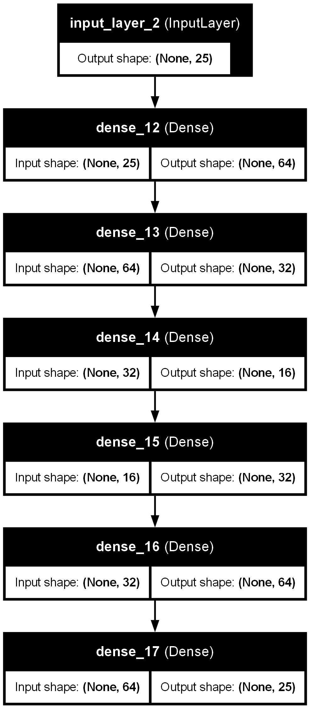

# Industrial Anomaly Detection Using Autoencoders

This project focuses on detecting anomalies in industrial equipment using deep learning-based autoencoders. The goal is to identify deviations in equipment behavior, which could indicate potential failures or issues that need attention.

## Table of Contents
1. [Introduction](#introduction)
2. [Project Structure](#project-structure)
3. [Installation](#installation)
4. [Usage](#usage)
5. [Model Architecture](#model-architecture)

## Introduction

Anomaly detection in industrial settings is crucial for predicting failures and maintaining operational efficiency. This project utilizes an autoencoder neural network to learn the normal behavior of industrial equipment and detect anomalies by calculating reconstruction errors.

The model is trained using Keras and TensorFlow.

## Project Structure

```plaintext
├── autoencoder_train.ipynb  # Jupyter notebook for model training
├── requirements.txt         # Python dependencies
├── autoencoder_model.h5     # Trained autoencoder model
```

## Installation

### 1) Clone the Repository
```bash
git clone https://github.com/UdayKiran112/Industrial-Anomaly-Detection.git
cd Industrial-Anomaly-Detection
```
### 2) Create and Activate a Python Virtual Environment
```bash
python -m venv Test_env
source Test_env/bin/activate  # On Windows use `Test_env\Scripts\activate`

```
### 3) Install the Required Dependencies
```bash
pip install -r requirements.txt

```

## Usage

### Training the model
```plaintext
1. Open autoencoder_train.ipynb in Jupyter Notebook.
2. Run the cells step-by-step to train the autoencoder model on your dataset.
3. The trained model will be saved as autoencoder_model.h5.
```

## Model Architecture
```plaintext
The autoencoder model is designed to capture normal patterns in the industrial dataset. It minimizes reconstruction error for normal data and identifies anomalies by detecting larger reconstruction errors.
```

